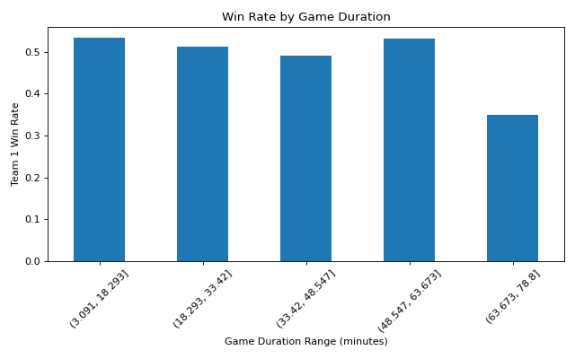
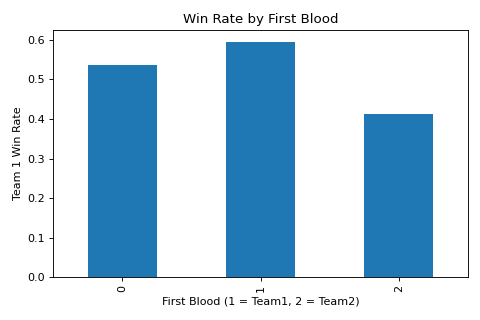
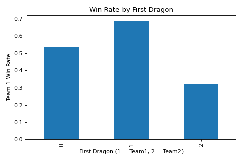
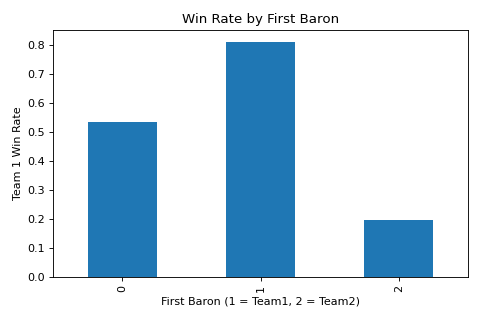

# League of Legends Data Analysis 🎮

A data analysis project exploring player performance, win rate trends, and champion efficiency in League of Legends using Python.

---

## Overview

This project analyzes League of Legends match data to understand gameplay patterns, champion performance, and factors influencing win rates.

---

## Features

* Calculated overall win rate
* Analyzed champion-specific win rates
* Computed KDA (Kills/Deaths/Assists) metrics
* Visualized performance trends using graphs

---

## Tech Stack

* Python
* Pandas
* Matplotlib

---

## What I Learned

* Data cleaning and preprocessing
* Aggregation and statistical analysis with Pandas
* Data visualization with Matplotlib
* Extracting insights from real-world gameplay data

---

## Run

```bash
pip install pandas matplotlib
python analysis.py
```

---

## Sample Output









