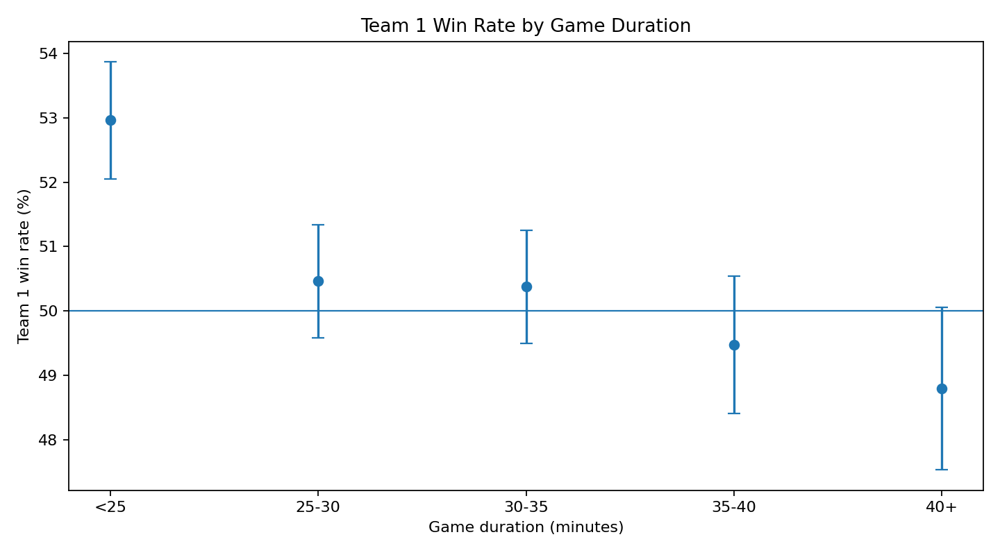
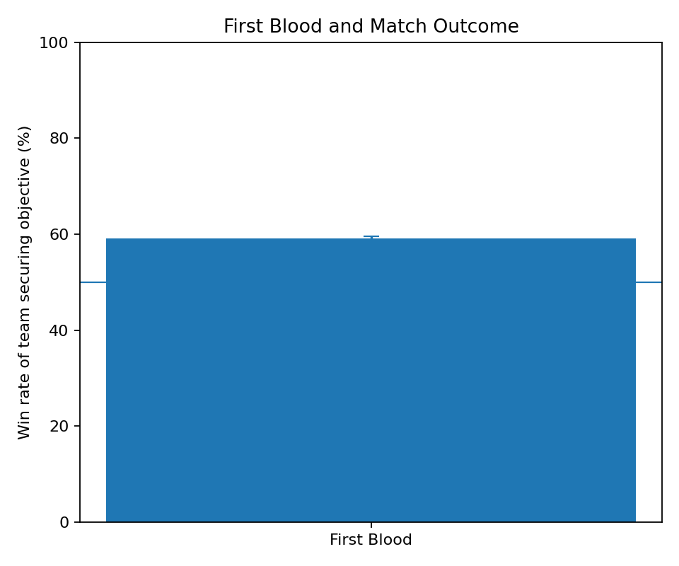
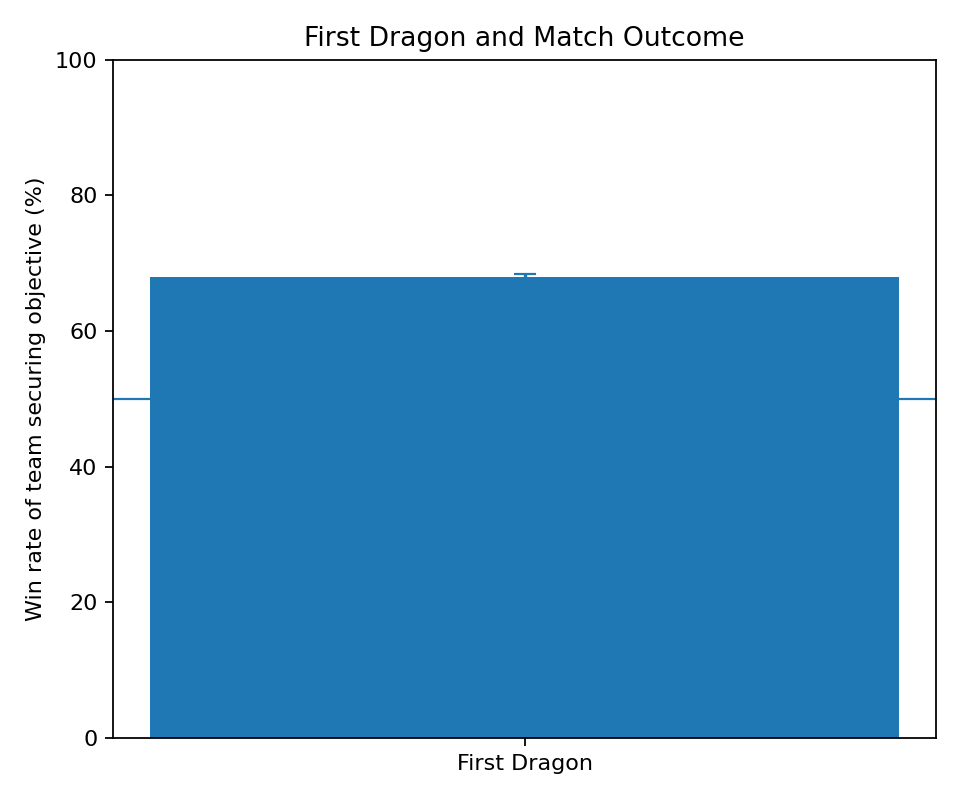
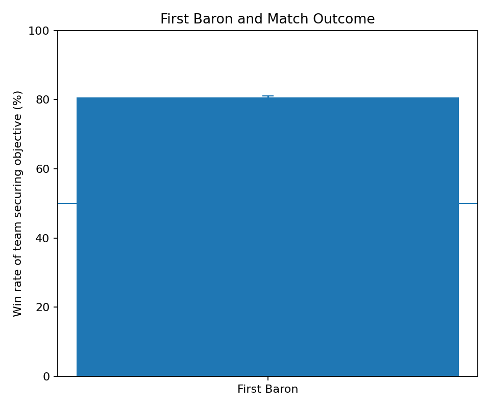

# League of Legends Match Outcomes Analysis

A reproducible exploratory analysis of **51,053 unique League of Legends matches** using Python, pandas, and Matplotlib. The project studies match duration, side balance, and how early objectives are associated with the eventual winner.

## Key results

- Team 1 won **50.65%** of matches, close to an even side split.
- Median game duration was **30.55 minutes**.
- The team that secured **First Blood** won **59.15%** of recorded matches.
- The team that secured **First Dragon** won **68.02%** of recorded matches.
- The team that secured **First Baron** won **80.67%** of recorded matches.

These are **descriptive associations, not causal estimates**. Stronger teams are also more likely to secure objectives, so the objective itself should not be interpreted as causing the entire observed win-rate difference.

## Analysis

The script removes exact duplicate source rows, rejects conflicting game IDs, validates the match-level schema, converts game duration to minutes, computes side and objective win rates, adds 95% Wilson confidence intervals, and exports summary tables and figures.

| Output | Description |
| --- | --- |
| `duration_summary.csv` | Team 1 win rate by game-duration bin |
| `objective_summary.csv` | First Blood / Dragon / Baron win rates with 95% confidence intervals |
| `winrate_by_duration.png` | Side win rate across duration bins |
| `first_blood_impact.png` | Win rate of the team securing First Blood |
| `dragon_impact.png` | Win rate of the team securing First Dragon |
| `baron_impact.png` | Win rate of the team securing First Baron |

## Visuals









## Run locally

```bash
python -m venv .venv
source .venv/bin/activate
python -m pip install -r requirements.txt
python analysis.py
python -m unittest -v
```

Windows PowerShell: activate with `.venv\Scripts\Activate.ps1`.

## Data notes

`matches.csv` contains 51,490 raw rows, including 437 exact duplicates. The analysis uses 51,053 unique matches; the original CSV is retained for traceability. It has 61 columns. The source schema contains match-level observations including the winning team, game duration, first-objective ownership, team objective counts, champion IDs, summoner spell IDs, and bans.

This repository intentionally focuses on a small set of interpretable questions rather than treating every available field as a feature. A natural extension would be a train/test predictive model with leakage controls and calibration analysis.

## Tech stack

Python · pandas · Matplotlib

The original upstream data URL and redistribution terms were not recorded in this repository. Results describe this historical sample, not the current game meta. Objectives observed during a match must not be used as pre-match predictors. Wilson intervals assume independent observations; repeat players and selection effects can affect uncertainty.
